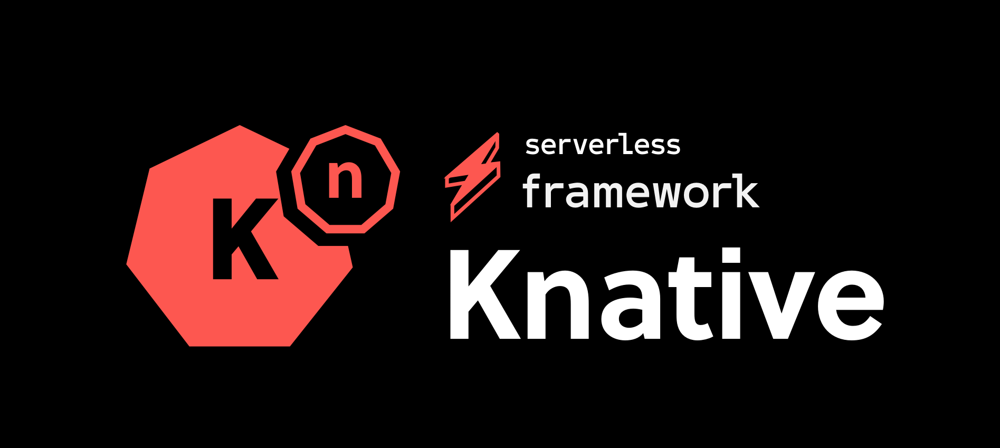
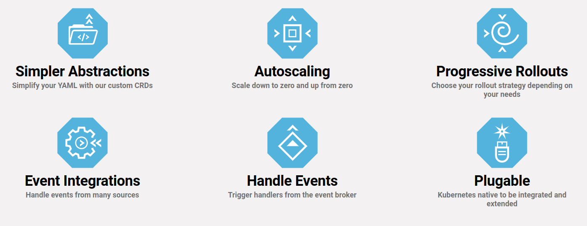
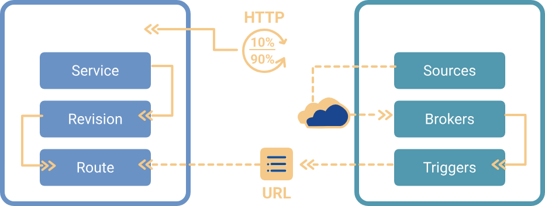
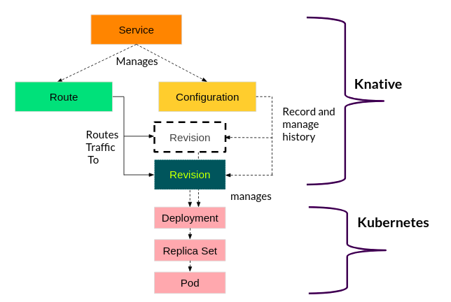
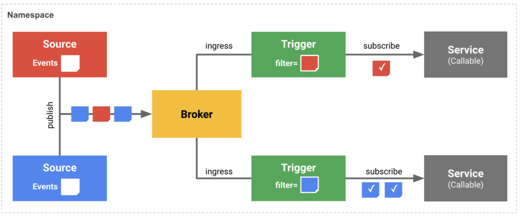

## What is serverless?
Serverless is a cloud-native development model that allows developers to build and run applications without having to manage servers.

There are still servers in serverless, but they are abstracted away from app development. A cloud provider handles the routine work of provisioning, maintaining, and scaling the server infrastructure. Developers can simply package their code in containers for deployment.

Once deployed, serverless apps respond to demand and automatically scale up and down as needed.

### Serverless Computing: A Catering Service Analogy

[Catering Service Analogy](https://www.freepik.com/premium-vector/catering-concept-illustration-idea-food-service-hotel-event-restaurant-banquet-party-catering-service-web-banner-illustration_10275389.htm)

Imagine you're hosting a dinner party. In a traditional hosting scenario, you'd have to plan everything from cooking the food to setting the table and serving your guests. This is like managing servers in traditional computing – you have to handle all the details yourself.

Now, consider a serverless approach as hiring a catering service for your party. You tell them what you need, and they take care of everything – from cooking the food to setting up and serving. You don't have to worry about the kitchen logistics or cleaning up afterward; you can focus on enjoying the party with your guests. Similarly, in serverless computing, you provide your code, and the cloud provider takes care of the infrastructure, scaling, and management, allowing you to focus on writing and improving your application.

### Kubernetes-Powered Serverless: Introducing Knative

[Serverless Framework Knative](https://www.serverless.com/blog/serverless-framework-knative-component)

In the rapidly evolving landscape of cloud computing, serverless technology has become increasingly popular for its simplicity in deploying applications without worrying about infrastructure. Knative, built on top of Kubernetes (k8s), extends the power of Kubernetes to manage serverless workloads seamlessly. While major cloud providers like AWS, Google Cloud, and Microsoft Azure offer their serverless solutions, Knative stands out as an open-source, platform-agnostic framework.

Collaboratively developed by industry leaders like Google and Red Hat, Knative abstracts away the complexities of deploying, scaling, and managing containerized applications, allowing developers to focus solely on writing code without worrying about infrastructure management. Knative simplifies serverless deployments across diverse cloud environments, revolutionizing the way applications are developed and deployed in modern cloud-native architectures.

### Exploring Knative Features: Simplifying Serverless Deployment

Serverless refers to running back-end programs and processes in the cloud. Serverless works on an as-used basis, meaning that companies only use what they pay for. Knative is a platform-agnostic solution for running serverless deployments.

- **Simpler Abstractions**: simplifies the YAML configuration process by providing custom CRDs (Custom Resource Definitions), 
                            streamlining the abstraction layers and making development workflows more straightforward.

- **Autoscaling**: autoscaling feature seamlessly adjusts resource allocation, scaling applications down to zero and up from zero based on demand.

- **Progressive Rollouts**: Customize your rollout strategy with Knative's Progressive Rollouts feature, offering flexibility to select the ideal 
                            approach based on your specific requirements.

- **Event Integrations**: Easily manage events from diverse sources with Knative's Event Integrations, streamlining event handling for seamless integration.

- **Handle Events**: Effortlessly trigger handlers from the event broker with Knative's event handling capabilities, ensuring seamless integration 
                    and streamlined workflow.

- **Plugable**: Knative's pluggable architecture ensures seamless integration and extension within the Kubernetes ecosystem, providing 
                flexibility and scalability for diverse use cases.

## Knative Components

Knative has two main components that empower teams working with Kubernetes. Serving and
Eventing work together to automate and manage tasks and applications.

- **Knative Serving**: Allows running serverless containers in Kubernetes with ease. Knative takes care of the details of networking, 
                       autoscaling (even to zero), and revision tracking. Teams can focus on core logic using any programming language.
- **Knative Eventing**: Allows universal subscription, delivery and management of events. Build modern apps by attaching compute to a 
                        data stream with declarative event connectivity and developer friendly object models.

### Knative Serving

Knative Serving defines a set of objects as Kubernetes Custom Resource Definitions (CRDs). These objects get used to define and control how your serverless workload behaves on the cluster:

Savita Ashture, [CC BY-SA 4.0](https://creativecommons.org/licenses/by-sa/4.0/)

- **Service**: A Knative Service describes a combination of a route and a configuration as shown above. It is a higher-level entity that does not provide any additional functionality. It should make it easier to deploy an application quickly and make it available. You can define the service to always route traffic to the latest revision or a pinned revision.

- **Route**: The Route describes how a particular application gets called and how the traffic gets distributed across the different revisions. There is a high chance that several revisions can be active in the system at any given time based on the use case in those scenarios. It's the responsibility of routes to split the traffic and assign to revisions.

- **Configuration**: The Configuration describes what the corresponding deployment of the application should look like. It provides a clean separation between code and configuration and follows the Twelve-Factor App methodology. Modifying a configuration creates a new revision.

- **Revision**: The Revision represents the state of a configuration at a specific point in time. A revision, therefore, gets created from the configuration. Revisions are immutable objects, and you can retain them for as long as useful. Several revisions per configuration may be active at any given time, and you can automatically scale up and down according to incoming traffic.

#### Knative Serving focuses on:
- Rapid deployment of serverless containers.
- Autoscaling includes scaling pods down to zero.
- Support for multiple networking layers such as Ambassador, Contour, Kourier, Gloo, and Istio for integration into existing environments.
- Give point-in-time snapshots of deployed code and configurations.

### Knative Eventing

Knative Eventing is a collection of APIs that enable you to use an event-driven architecture with your applications. You can create components that route events from event producers to event consumers, known as sinks, that receive events.

#### Use-cases
General areas of application are:

- Publishing an event without creating a consumer. You can send events to a broker as an HTTP POST, and use binding to decouple the destination configuration from your application that produces events.

- Consuming an event without creating a publisher. You can use a trigger to consume events from a broker based on event attributes.

- IoT, network monitoring, application monitoring, website testing and validation, and mobile app front-end processes that act as event generators.

#### Use Knative eventing when:

- When you want to publish an event without creating a consumer. You can send events to a broker as an HTTP POST, and use binding to decouple the destination configuration from your application that produces events.

- When you want to consume an event without creating a publisher. You can use a trigger to consume events from a broker based on event attributes. The application receives events as an HTTP POST.

- When you want to create components that route events from event producers to event consumers, known as sinks, that receive events. Sinks can also be configured to respond to HTTP requests by sending a response event.

[Eventing Components](https://dev.to/ashokan/knative-eventing-e95)

#### Components

- **Sources**: Knative eventing sources are objects that generate events and send them to a sink. They are created by instantiating a custom resource (CR) from a source object. There are different types of sources, such as PingSource, ApiServerSource, KafkaSource, etc., depending on the event producer.

- **Sinks**: Knative eventing sinks are objects that receive events from sources or other components. They can be Addressable or Callable resources that have an address defined in their status.address.url field. Addressable sinks can receive and acknowledge an event delivered over HTTP, while Callable sinks can also respond to HTTP requests by sending a response event. Knative Services, Channels, and Brokers are all examples of sinks.

- **Brokers**: Knative eventing brokers are objects that define an event mesh for collecting a pool of events. Brokers provide a discoverable endpoint for event ingress, and use triggers for event delivery. Event producers can send events to a broker by posting the event.

- **Channels**: Channels are custom resources that define a single event-forwarding and persistence layer. You can connect channels to various backends for sourcing events, such as In-Memory, Kafka, or GCP PubSub. You can also fan-out received events, through subscriptions, to multiple destinations, or sinks. Examples of sinks include brokers and Knative services.

- **Subscriptions**: Knative subscriptions are objects that enable event delivery from a channel to an event sink, also known as a subscriber. A subscription specifies the channel and the sink to deliver events to, as well as some sink-specific options, such as how to handle failures.

- **Triggers**: Knative Triggers are objects that enable seamless integration with external event sources, allowing applications to react dynamically to incoming events, fostering the development of scalable, event-driven architectures.

## Conclusion

In this overview, we've explored serverless computing with Knative on Kubernetes, covering core concepts, features, and components. Stay tuned for practical implementations and real-world use cases in upcoming blogs, unlocking Knative's full potential for your projects. With Knative, the future of serverless on Kubernetes is brighter than ever.

Furthermore, I'm excited to announce that our platform, [WeDAA](https://app.wedaa.tech/), will be hosting these upcoming blogs. WeDAA is committed to providing innovative solutions, and soon, we'll be incorporating serverless capabilities into our platform. Keep an eye out for our future updates, as we continue to evolve and enhance our services to meet your needs.